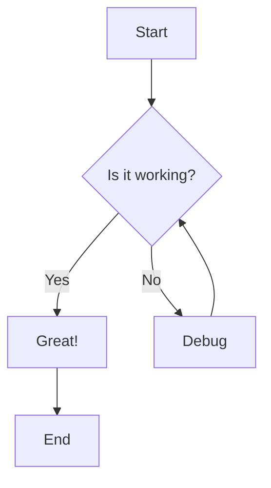
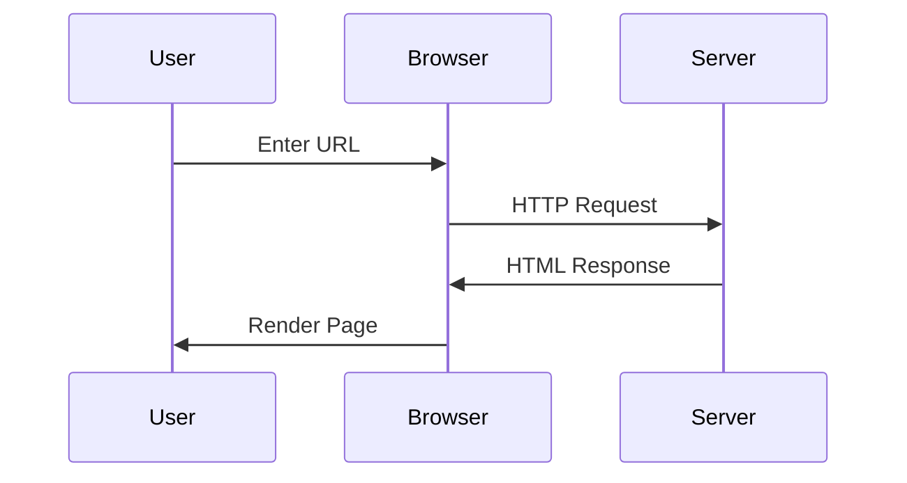

This post demonstrates  available markdown features for Jekyll posts. 

## Text Formatting

### Basic Text Styles
This is **bold text** and this is *italic text*. You can also use __bold__ and _italic_ with underscores.

Here's ***bold and italic together***.

This is ~~strikethrough text~~.

### Headings
# Heading 1
## Heading 2  
### Heading 3
#### Heading 4
##### Heading 5
###### Heading 6

### Paragraphs and Line Breaks
This is a paragraph. Lorem ipsum dolor sit amet, consectetur adipiscing elit. Sed do eiusmod tempor incididunt ut labore et dolore magna aliqua.

This is another paragraph with a  
manual line break using two spaces.

---

## Lists

### Unordered Lists
- Item one
- Item two
  - Nested item A
  - Nested item B
    - Deeply nested item
- Item three

* Alternative bullet style
+ Another bullet style

### Ordered Lists
1. First item
2. Second item
   1. Nested numbered item
   2. Another nested item
3. Third item

### Task Lists (GitHub Flavored Markdown)
- [x] Completed task
- [x] Another completed task
- [ ] Incomplete task
- [ ] Another incomplete task
  - [x] Nested completed task
  - [ ] Nested incomplete task

---

## Links and References

### Inline Links
Visit [Jekyll Documentation](https://jekyllrb.com/docs/) for more information.

### Reference Links
Check out the [GitHub Pages docs][1] and [Markdown Guide][2].

[1]: https://pages.github.com/
[2]: https://www.markdownguide.org/

### Automatic Links
<https://github.com/Jasonw-cs>

### Email Links
<jason@example.com>

---

## Images

### Basic Image


### Image with Title and Caption


### Linked Image
<div>
<a href="https://github.com/Jasonw-cs" target="_blank" rel="noopener noreferrer">
  
</a>
</div>

---

## Tables

### Basic Table
| Feature | Status | Priority |
|---------|--------|----------|
| Tables | ✅ Working | High |
| Alignment | ✅ Working | Medium |
| Styling | 🔄 In Progress | Low |

### Aligned Table
| Left Aligned | Center Aligned | Right Aligned |
|:-------------|:--------------:|--------------:|
| Content | Content | Content |
| More content | More content | More content |

### Complex Table
| Language | Syntax Highlighting | GitHub Pages Support | Difficulty |
|----------|:------------------:|:--------------------:|-----------:|
| JavaScript | ✅ Yes | ✅ Yes | Easy |
| Python | ✅ Yes | ✅ Yes | Easy |
| Ruby | ✅ Yes | ✅ Yes | Medium |
| Rust | ✅ Yes | ✅ Yes | Hard |

---

## Code

### Inline Code
Use `npm install` to install packages. The `console.log()` function prints output.

### Code Blocks

#### Syntax Highlighting
```javascript
// JavaScript example
function greetUser(name) {
  const greeting = `Hello, ${name}!`;
  console.log(greeting);
  return greeting;
}

greetUser('Jason');
```

```python
# Python example
def calculate_sum(numbers):
    """Calculate the sum of a list of numbers."""
    total = sum(numbers)
    print(f"The sum is: {total}")
    return total

result = calculate_sum([1, 2, 3, 4, 5])
```

```bash
# Bash/Shell commands
npm install -g jekyll
bundle exec jekyll serve --drafts
git add .
git commit -m "Add new post"
git push origin main
```

```yaml
# YAML Configuration
title: My Jekyll Site
description: A blog about web development
plugins:
  - jekyll-feed
  - jekyll-seo-tag
  - jekyll-sitemap
```

```json
{
  "name": "my-project",
  "version": "1.0.0",
  "scripts": {
    "start": "jekyll serve",
    "build": "jekyll build"
  }
}
```

#### Code with Line Numbers
```ruby {linenos=table}
# Ruby Jekyll plugin example
class MyPlugin < Jekyll::Generator
  def generate(site)
    site.posts.docs.each do |post|
      post.data['reading_time'] = calculate_reading_time(post.content)
    end
  end
  
  private
  
  def calculate_reading_time(content)
    words = content.split.size
    (words / 200.0).ceil
  end
end
```

#### Liquid Syntax Examples (Properly Escaped)

```liquid
<!-- Jekyll/Liquid template examples -->
{{ site.title }}
{{ page.date | date: "%B %d, %Y" }}


  <h3>{{ post.title }}</h3>
  <p>{{ post.excerpt }}</p>



  <p>This post is about Jekyll!</p>

```


---

## Blockquotes

### Simple Blockquote
> This is a blockquote. It can span multiple lines and is great for highlighting important information or quotes from other sources.

### Nested Blockquote
> This is the outer blockquote.
> 
> > This is a nested blockquote inside the first one.
> 
> Back to the outer blockquote.

### Blockquote with Citation
> The best way to get started is to quit talking and begin doing.
> 
> — Walt Disney

---

## Horizontal Rules

Use three or more dashes, asterisks, or underscores:

---

***

___

---

## Special Characters and Escaping

### HTML Entities
Copyright &copy; 2025 Jason-json  
Registered &reg; trademark  
Arrows: &larr; &uarr; &rarr; &darr;  
Math: &alpha; &beta; &gamma; &delta;

### Escaped Characters
\*This text is not italic\*  
\# This is not a heading  
\[This is not a link\]

---

## Advanced Features

### Footnotes
Here's a sentence with a footnote[^1]. And here's another[^note].

[^1]: This is the first footnote.
[^note]: This is a named footnote with more content. It can contain multiple paragraphs and even code.

### Definition Lists
Term 1
: Definition for term 1

Term 2
: Definition for term 2
: Another definition for term 2

### Abbreviations
*[HTML]: Hyper Text Markup Language
*[CSS]: Cascading Style Sheets

The HTML and CSS standards are maintained by W3C.

---

## Math Equations (if MathJax enabled)

### Inline Math
The quadratic formula is $x = \frac{-b \pm \sqrt{b^2 - 4ac}}{2a}$.

### Display Math
$$
E = mc^2
$$

$$
\sum_{i=1}^{n} x_i = x_1 + x_2 + \cdots + x_n
$$

---

## Diagrams (if Mermaid enabled)

### Flowchart


### Sequence Diagram


---

## Custom HTML (when needed)

### Details/Summary
<details>
<summary>Click to expand</summary>

This content is hidden by default and shown when the user clicks the summary.

You can include:
- Lists
- **Formatted text**
- `Code`
- And any other markdown!

</details>

### Keyboard Keys
Press <kbd>Ctrl</kbd> + <kbd>C</kbd> to copy and <kbd>Ctrl</kbd> + <kbd>V</kbd> to paste.

### Highlight Text
This is <mark>highlighted text</mark> using HTML.

---

## Jekyll-Specific Features

### Including Files

<!-- Example include syntax (requires creating the include file first) -->



### Front Matter Variables
- **Post Title**: {{ page.title }}
- **Author**: {{ page.author }}
- **Date**: {{ page.date | date: "%B %d, %Y" }}
- **Tags**: {{ page.tags | join: ", " }}

### Site Variables
- **Site Title**: {{ site.title }}
- **Site Description**: {{ site.description }}

---

## Performance and Accessibility

### Image Best Practices
```markdown

```

### Semantic HTML
Use proper heading hierarchy (H1 → H2 → H3) for better SEO and accessibility.

### Loading Performance
For images, consider:
- WebP format for better compression
- Lazy loading for below-the-fold content
- Proper alt text for screen readers

---

## Tips for Content Creation

### Writing Guidelines
1. **Use descriptive headings** for better navigation
2. **Include alt text** for all images
3. **Structure content** with proper hierarchy
4. **Use code blocks** for better syntax highlighting
5. **Escape liquid syntax** when showing examples

### Common Patterns
- **Tutorial posts**: Use numbered lists and code examples
- **Reference posts**: Use tables and definition lists
- **Project updates**: Use task lists and progress indicators
- **Technical posts**: Include diagrams and code samples

---
